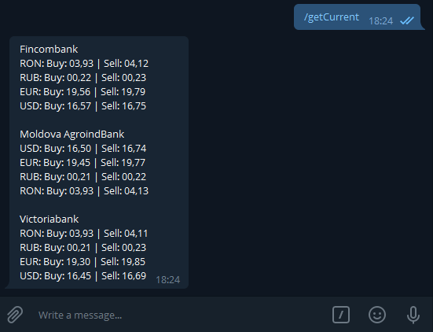

# MoldovaExchangeRateProcessor
Processor for parsing, storing and processing exchange rates, a telegram bot serving exchange info  
Automatic docker deploy

## Projects in solution
### 1. MoldovaExchangeRateProcessor.ProcessorWorkerService
A worker service type project, that parses the exchange rates on bank web sites **every 4 hours** and updates them in db.

### 2. MoldovaExchangeRateProcessor.TelegramBot
A console type project. A telegram bot that serves the info about the rates from db.  
<p align="center">
  
</p>

### 3. MoldovaExchangeRateProcessor.WebParser
A class library type project. A library that serves the web parser functionality and db models.

## Deploy instructions
### 1. Open the docker-compose.yml file and set up your connection string (non mandatory) and telegram bot api key (mandatory)


### 2. Open a shell in the main folder of the solution and execute the following
```
docker-compose up -d
```

### 3. Wait for the startup process to finish, then try requesting the rates by sending the following command to your bot
```
/getCurrent
```
